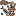
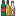
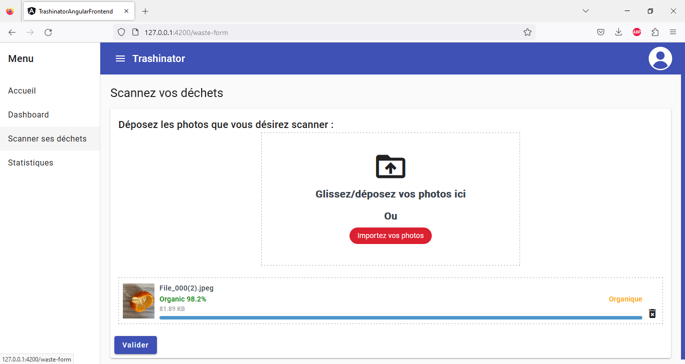
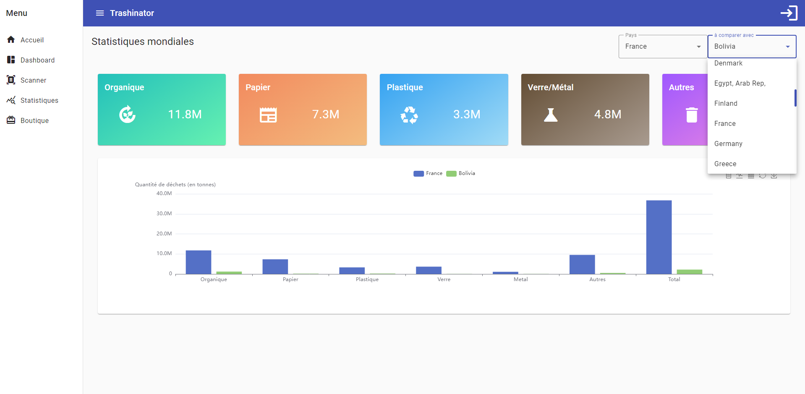

# Trashinator3000 
- [Trashinator3000 ](#trashinator3000-)
  - [What is Trashinator3000 ?](#what-is-trashinator3000-)
  - [Objectives](#objectives)
- [How to use it ?](#how-to-use-it-)
  - [Quickstart](#quickstart)
  - [Scan trash](#scan-trash)
  - [Worldwide stats](#worldwide-stats)
- [Credits](#credits)
  - [Icons](#icons)

## What is Trashinator3000 ?

Trashinator3000 is a web tool used to scan images of trash and categorize them in the following classes: 
- Organic
  &nbsp&nbsp&nbsp&nbsp&nbsp&nbsp&nbsp&nbsp&nbsp&nbsp&nbsp&nbsp
   
- Paper
  &nbsp&nbsp&nbsp&nbsp&nbsp&nbsp&nbsp&nbsp&nbsp&nbsp&nbsp&nbsp&nbsp&nbsp&nbsp&nbsp
   
- Plastic
  &nbsp&nbsp&nbsp&nbsp&nbsp&nbsp&nbsp&nbsp&nbsp&nbsp&nbsp&nbsp&nbsp&nbsp&nbsp
   
- Glass & Metals
  &nbsp
   
- Others
  &nbsp&nbsp&nbsp&nbsp&nbsp&nbsp&nbsp&nbsp&nbsp&nbsp&nbsp&nbsp&nbsp&nbsp
   

## Objectives

Trashinator3000 aims to help people categorize trash and sensibilize them to recycling. 

***

# How to use it ?

## Quickstart
- Download Node.js on https://nodejs.org/en/
- Run npm install -g @angular/cli using Node.js with the windows CLI
- Run quickstart.bat 
- Open [127.0.0.1:4200](127.0.0.1:4200)

## Scan trash

You can scan trash using the "Scanner ses déchets" (Scan trash) menu on the right side of the screen. Either you drag and drop an image, or you can select it in your file explorer using the red button. 
Once the image is completely uploaded, you can press the validate button to display the class of the trash on the image and the accuracy of the classification given by the neural network.

## Worldwide stats

You can also check the recycling stats per country in the "Statistiques" (Statistics) menu. 

# Credits
## Icons
All icons used for the README file (available under the img folder) come from Flaticon:  
- <a href="https://www.flaticon.com/free-icons/trash-can" title="trash can icons">Trash can icons created by Rohim - Flaticon</a> 
- <a href="https://www.flaticon.com/free-icons/food-waste" title="food waste icons">Food waste icons created by surang - Flaticon</a> 
- <a href="https://www.flaticon.com/free-icons/paper" title="paper icons">Paper icons created by Freepik - Flaticon</a> 
- <a href="https://www.flaticon.com/free-icons/plastic" title="plastic icons">Plastic icons created by nawicon - Flaticon</a> 
- <a href="https://www.flaticon.com/free-icons/bottle" title="bottle icons">Bottle icons created by Freepik - Flaticon</a> 
- <a href="https://www.flaticon.com/free-icons/mask" title="mask icons">Mask icons created by Freepik - Flaticon</a>